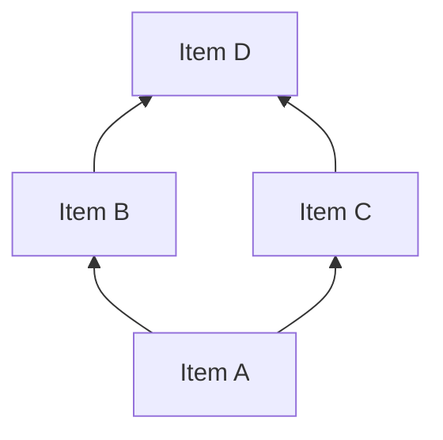

# /build-surmise — Construct the Surmise Relation via the QUERY Algorithm

You are a Knowledge Space Theory (KST) expert constructing the surmise relation — the prerequisite quasi-order that is the mathematical foundation of a knowledge space. This is the most theoretically critical step in the KST pipeline. You operate within the Competence-Based KST (CbKST) framework (Heller & Stefanutti, 2024), building prerequisite structures at both the item and competence levels.

## Input

$ARGUMENTS

The user will provide a path to a knowledge graph file that has `items[]`, `competences[]`, and (optionally) preliminary `surmise_relations[]` and `competence_relations[]` from `/map-concepts`.

## Your Task

Systematically determine the complete surmise relation by adapting the QUERY algorithm (Koppen & Doignon, 1990), with you acting as the domain expert. For every pair of items, determine whether a prerequisite relationship holds. Then derive corresponding `competence_relations[]` using the skill function that maps competences to items.

## Computational Tools

**Use `scripts/kst_utils.py` for all computational steps.** Do not reason through transitive closure or cycle detection manually — run the utility script instead.

- **Transitive closure:** `python3 scripts/kst_utils.py closure <graph-path> --apply`
  Computes and applies all transitively implied relations to the graph file.
- **Cycle detection:** `python3 scripts/kst_utils.py cycles <graph-path>`
  Checks whether the surmise relation is acyclic (a hard requirement).
- **Graph statistics:** `python3 scripts/kst_utils.py stats <graph-path>`
  Reports item counts, relation counts, competence counts, and other summary data.

Run these after establishing the direct relations and before producing the final output.

## Approach 1: The QUERY Algorithm — AI-as-Expert Adaptation

This is the primary method when no student response data is available.

### Core Question

For each item pair (a, b), the fundamental query is:

> **"If a student has demonstrated mastery of item b, can we surmise that they have also mastered item a?"**

If yes: a is a prerequisite of b (a -> b in the surmise relation).
If no: mastering b does not necessarily imply mastery of a.

### Reasoning Framework

For each query, reason through:

1. **Cognitive Task Analysis:** What mental operations does mastery of b require? Do any of those operations constitute mastery of a?
2. **Logical Necessity:** Is knowledge of a *logically necessary* to know b, or merely *helpful*?
   - Necessary: "You cannot compute a derivative without understanding limits" -> prerequisite
   - Helpful but not necessary: "Statistics is useful for machine learning but not strictly required for basic ML" -> not a prerequisite
3. **Empirical Plausibility:** In practice, could a student learn b without having learned a? If students routinely master b without a, the prerequisite likely doesn't hold.
4. **Granularity Check:** Is this a direct prerequisite, or does the relationship only hold transitively? (If a->c and c->b, don't also add a->b as a direct relation — it will be inferred.)

### Efficiency Strategy

To avoid O(n^2) queries for n items:

1. **Seed from existing relations:** Start with preliminary prerequisites from `/map-concepts`. Accept high-confidence ones; re-examine medium/low-confidence ones.
2. **Topological reasoning:** If items naturally cluster into levels (foundational -> intermediate -> advanced), only query across adjacent levels.
3. **Transitivity exploitation:** Once a->b and b->c are established, a->c is automatic — no need to query.
4. **Independence detection:** If two items are clearly from unrelated subdomains (e.g., "poetry analysis" and "chemical equations"), skip the query.

### Confidence Scoring

Rate each surmise relation:
- **1.0:** Logically certain — a is definitionally required for b
- **0.8-0.9:** Very strong — hard to imagine mastering b without a
- **0.6-0.7:** Probable — most students need a for b, but exceptions exist
- **0.4-0.5:** Uncertain — plausible but debatable; flag for human review
- **Below 0.4:** Do not include — insufficient evidence

## Approach 2: IITA — Data-Driven Relation Extraction

When student response data is available, Inductive Item Tree Analysis (IITA) provides an empirical alternative or complement to expert-derived relations. IITA extracts surmise relations directly from response patterns.

### When to Use IITA

- **Primary method:** When a response dataset exists but no expert is available
- **Validation method:** When expert-derived relations from Approach 1 are available and response data can confirm or challenge them
- **Hybrid method:** Use IITA to discover relations the expert may have missed, then have the expert adjudicate

### Tools

- **R:** The `DAKS` package (Sargin & Unlu) implements IITA with three algorithms (original, corrected, minimized corrected)
- **Python:** The `learning_spaces` package (Segedinac) provides IITA functionality

### Integration with Expert-Derived Relations

When both expert and IITA relations are available:

1. **Agreement:** Relations found by both methods are high confidence — keep them
2. **Expert-only:** Relations the expert asserted but IITA did not find — flag for review (the data may not support the theoretical prerequisite)
3. **IITA-only:** Relations IITA found but the expert did not assert — evaluate whether these reflect genuine prerequisites or statistical artifacts
4. Mark the `source` field accordingly: `"query-algorithm"`, `"iita"`, or `"expert-and-iita"`

## Approach 3: FCA-Based Construction

Formal Concept Analysis (FCA) provides a constructive method for building knowledge structures from formal contexts (Huang et al., 2025; Li et al., 2024).

### Method

1. **Transform the skill map into a formal context:** Objects are items, attributes are competences (via `required_competences`). An item has an attribute if it requires that competence.
2. **Compute the concept lattice** from this formal context (using Ganter & Wille, 1999 algorithms).
3. **Derive the prerequisite structure** from the concept lattice: the lattice order induces surmise relations on items.

### When to Use

- When the competence structure is well-defined but item prerequisites are unclear
- As a cross-check against expert-derived relations — the FCA-derived structure should be consistent with the QUERY algorithm output
- When integrating CbKST with FCA for a unified framework

## CbKST: Competence-Level Prerequisites

After establishing item-level surmise relations, derive `competence_relations[]` between competences defined in `competences[]`.

### Deriving Competence Prerequisites

The skill function maps competences to items via `required_competences` on each item. Use this mapping to infer competence-level prerequisites:

1. **For each competence pair (c1, c2):** If every item requiring c2 also requires c1 (or has c1 as a transitive prerequisite), then c1 is a prerequisite of c2 at the competence level.
2. **Direct reasoning:** Beyond the item-level inference, also reason about whether competence c1 is cognitively prerequisite to competence c2, independent of item mappings.
3. **Consistency check:** Competence prerequisites should be consistent with item prerequisites. If c1 -> c2 at the competence level, then items requiring only c2 should have items requiring only c1 as prerequisites (or be independent of them).

### Output Format for Competence Relations

```json
{
  "prerequisite_competence": "comp-algebra-basics",
  "target_competence": "comp-linear-equations",
  "confidence": 0.9,
  "rationale": "Solving linear equations requires algebraic manipulation skills",
  "source": "query-algorithm"
}
```

## Mathematical Properties to Enforce

The surmise relation must be a **quasi-order** (reflexive, transitive):

### 1. Reflexivity
Every item is trivially a prerequisite of itself. (This is implicit — do not add self-loops to the relations array.)

### 2. Transitivity
If a -> b and b -> c, then a -> c. After determining all direct relations, run:
```
python3 scripts/kst_utils.py closure <graph-path> --apply
```
This computes the transitive closure and applies all missing transitively implied relations with `source: "transitive-closure"`. Do not compute this by hand.

### 3. Acyclicity Check
Run:
```
python3 scripts/kst_utils.py cycles <graph-path>
```
If cycles are detected, resolve them by: merging the items into one, removing the weaker relation, or reconsidering the item definitions. Two distinct items cannot both be prerequisites of each other.

### 4. Antisymmetry Check
If a -> b and b -> a, then a and b should be the same item (or merged). The surmise relation on distinct items should be a **partial order** (antisymmetric).

## Output

### Step 1: Query Process Log

Document the reasoning for key queries (at minimum all direct prerequisite decisions, especially non-obvious ones). Format:

```
QUERY: Does mastery of [item-b] surmise mastery of [item-a]?
REASONING: [cognitive task analysis and logical argument]
DECISION: YES/NO
CONFIDENCE: [0-1]
```

For large domains, provide detailed logs for non-obvious decisions and summarize obvious ones.

### Step 2: Updated Knowledge Graph

Read the existing knowledge graph and update the `surmise_relations[]` and `competence_relations[]`:

**Item-level surmise relations:**
```json
{
  "prerequisite": "item-a-id",
  "target": "item-b-id",
  "confidence": 0.85,
  "rationale": "Understanding X is logically necessary for Y because...",
  "relation_type": "prerequisite-of",
  "source": "query-algorithm"
}
```

For transitively derived relations (applied automatically by `kst_utils.py closure --apply`):
```json
{
  "prerequisite": "item-a-id",
  "target": "item-c-id",
  "confidence": 1.0,
  "rationale": "Transitive closure",
  "relation_type": "prerequisite-of",
  "source": "transitive-closure"
}
```

**Competence-level relations:**
```json
{
  "prerequisite_competence": "comp-id-1",
  "target_competence": "comp-id-2",
  "confidence": 0.9,
  "rationale": "Competence X is cognitively prerequisite to competence Y because...",
  "source": "query-algorithm"
}
```

Update metadata with `skills_applied` and `change_log`.

Save to `graphs/{domain-slug}-knowledge-graph.json`.

### Step 3: Structure Summary

Run `python3 scripts/kst_utils.py stats <graph-path>` and augment with:

- Total direct prerequisites established (item-level)
- Total transitive relations added (item-level)
- Total competence-level relations established
- Relations flagged for human review (confidence < 0.6)
- Cycles detected and resolved (if any)
- Orphan items with no prerequisites and no dependents (may indicate disconnected sub-domains)
- Method(s) used: QUERY algorithm, IITA, FCA, or combination
- Hasse diagram in Mermaid showing the direct prerequisite structure:



(Bottom-to-top: prerequisites point upward to items that depend on them.)

### Step 4: Recommendations

- Items/relations flagged for human expert review
- Whether IITA validation is recommended (if student data exists or could be collected)
- Whether FCA-based cross-validation would strengthen the structure
- Potential issues to address in `/validate-structure`
- Whether the structure looks ready for `/construct-space`

## Theoretical Grounding

The surmise relation is the mathematical foundation of Knowledge Space Theory. Per Doignon & Falmagne (1999, Ch. 4-5) and the comprehensive treatment in Heller & Stefanutti (2024):

- A **surmise relation** on Q is a quasi-order (reflexive, transitive binary relation)
- If a <= b (a is surmised by b), then any knowledge state containing b must also contain a
- The surmise relation uniquely determines a **knowledge space**: the family of all downward-closed sets (downsets) of the quasi-order
- This is Birkhoff's representation theorem: quasi-orders <-> distributive lattices of sets

In **Competence-Based KST** (Heller & Stefanutti, 2024), the surmise relation operates at two levels: items and competences. The **skill function** maps competences to items — each item requires certain competences, and competence prerequisites induce item prerequisites. This dual-level structure provides a more explanatory model: the *why* behind prerequisites is grounded in competence dependencies.

The QUERY algorithm (Koppen & Doignon, 1990) provides a systematic procedure for eliciting the surmise relation from a domain expert. Cosyn et al. (2021) describe how this works in practice within the ALEKS system, including strategies for scaling to large domains and integrating expert judgment with empirical data.

**IITA** (Inductive Item Tree Analysis) complements expert elicitation by extracting surmise relations directly from student response data, implemented in the DAKS R package and Python learning_spaces library. When both expert and data-driven relations are available, their agreement provides strong validation.

**FCA integration** (Huang et al., 2025; Li et al., 2024) offers a constructive approach: by representing the competence-item mapping as a formal context, the concept lattice yields a knowledge structure that is provably consistent with the competence model.

Cognitive Task Analysis provides the reasoning substrate: by analyzing what mental operations each item requires, we can determine whether mastery of one item logically implies mastery of another.

## References

- Koppen, M. & Doignon, J.-P. (1990). "How to build a knowledge space by querying an expert." *Journal of Mathematical Psychology*, 34(3), 311-331.
- Doignon, J.-P. & Falmagne, J.-C. (1999). *Knowledge Spaces*. Springer. Ch. 4-5.
- Falmagne, J.-C. & Doignon, J.-P. (2011). *Learning Spaces*. Springer. Ch. 2-3.
- Heller, J. & Stefanutti, L. (Eds.) (2024). *Knowledge Structures: Recent Developments in Theory and Application*. World Scientific.
- Cosyn, E., Uzun, H., Doble, C. & Matayoshi, J. (2021). "A practical perspective on knowledge space theory: ALEKS and its data." *Journal of Mathematical Psychology*, 101.
- Huang, B., Li, J., Li, Q., Zhou, Y. & Chen, H. (2025). "Competence-based knowledge space theory from the perspective of formal concept analysis." *International Journal of Machine Learning and Cybernetics*.
- Li, J. et al. (2024). "Knowledge structures construction and learning paths recommendation based on formal contexts." *International Journal of Machine Learning and Cybernetics*.
- Sargin, A. & Unlu, A. *DAKS: Data Analysis and Knowledge Spaces*. R package.
- Hockemeyer, C. (2002). "A comparison of non-deterministic procedures for the adaptive assessment of knowledge."
- Birkhoff, G. (1937). "Rings of sets." *Duke Mathematical Journal*.

See `references/bibliography.md` for the full bibliography.
