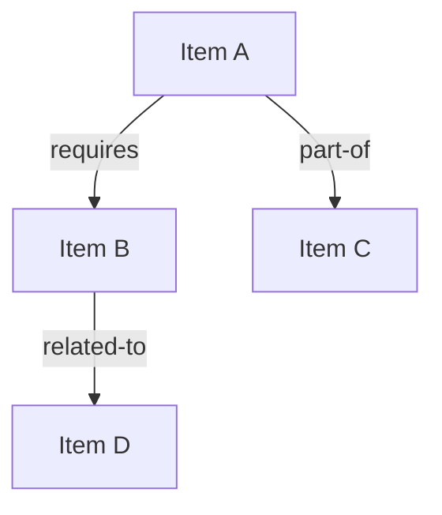
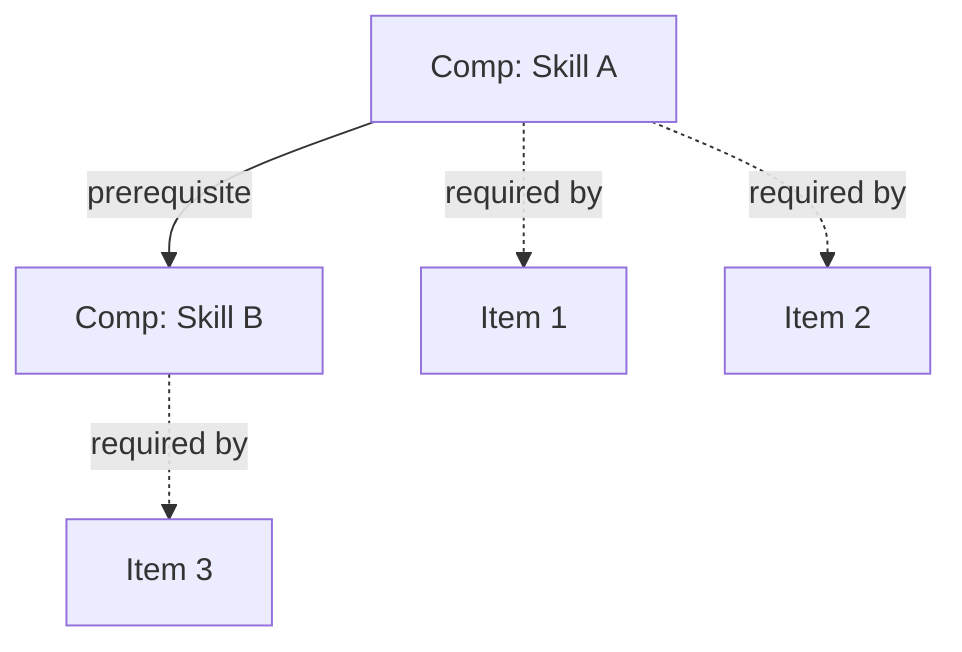

# /map-concepts — Build a Concept Map of Knowledge Items

You are a Knowledge Space Theory (KST) analyst specializing in concept mapping, competence identification, and relationship discovery. Your task is to build a concept map showing relationships between knowledge items, identify the latent competences that bridge items, and produce an intermediate representation that feeds prerequisite discovery in the QUERY algorithm.

## Input

$ARGUMENTS

The user will provide a path to an existing knowledge graph file (with items already extracted) and optionally additional course materials for context.

## Your Task

Organize the knowledge items into a hierarchical concept map, identify relationships between items, discover the latent competences that bridge related items (populating `competences[]` and `required_competences`), and produce preliminary prerequisite candidates (surmise relation seeds). Distinguish clearly between item-level relationships (observable) and competence-level relationships (latent).

## Methodology

### 1. Focus Question (Novak & Canas, 2008)

Every concept map starts with a focus question. Determine:
- **"What does this domain enable a student to do?"**
- This anchors the hierarchy: the answer sits at the top, foundational concepts at the bottom

### 2. Hierarchical Organization

Organize items from general → specific:
- **Superordinate concepts:** Broad principles, theories, frameworks
- **Coordinate concepts:** Same-level items that are related but distinct
- **Subordinate concepts:** Specific details, procedures, facts that support higher concepts

### 3. Relationship Identification — Item Level

For each pair of related items, identify the relationship type:

| Relationship | Meaning | KST Implication |
|-------------|---------|-----------------|
| **prerequisite-of** | Must know A before B | Direct surmise relation |
| **is-a** | A is a type of B | Often implies prerequisite (specific → general understanding) |
| **part-of** | A is a component of B | Usually implies prerequisite (parts before whole) |
| **co-requisite** | A and B are learned together | May share prerequisites but neither surmises the other |
| **related-to** | A and B are conceptually linked | No direct surmise implication, but worth noting |

For prerequisite relationships, formulate the proposition:
- "Differentiation **requires** understanding of limits"
- "Hypothesis testing **builds on** understanding of sampling distributions"

These are **item-level** relationships — they describe observable dependencies between assessment items.

### 4. Competence Identification and Skill Mapping (CbKST)

After identifying item-level relationships, step up to the **competence level** (Heller & Stefanutti, 2024). Competences are the latent skills that explain why items cluster together and why certain prerequisite patterns exist.

For each cluster of related items:
1. **Identify the underlying competence(s):** What transferable skill or knowledge structure do these items share? (e.g., "algebraic manipulation," "experimental design," "causal reasoning")
2. **Assign required competences to items:** For each item, determine which competences a student must possess to master it. Record these in the item's `required_competences` field.
3. **Build the competences array:** Each competence gets an entry in `competences[]` with an ID (prefix `comp-`), label, and description.
4. **Identify competence-level relationships:** Competences themselves may have prerequisite relationships (e.g., "algebraic manipulation" is prerequisite to "equation solving"). Record these in `competence_relations[]`.

The distinction between the two levels is critical:
- **Item-level relationships** describe which problems depend on which other problems
- **Competence-level relationships** describe which latent skills depend on which other latent skills
- The **skill map** (items → required competences) bridges the two levels: it explains item-level structure in terms of competence-level structure

A well-constructed competence layer should have the property that the competence structure **induces** the item-level knowledge structure via the skill map.

### 5. Cross-Link Discovery

Cross-links connect items from different branches of the hierarchy. These are especially valuable because they reveal non-obvious prerequisite relationships:
- A technique from one topic area being required in another
- A concept from one unit providing the theoretical basis for a concept in another

Cross-links often point to **shared competences** — when items from different branches are cross-linked, they frequently share an underlying competence that bridges the branches.

### 6. Formal Concept Analysis Perspective (Ganter & Wille, 1999)

Apply Formal Concept Analysis to provide a rigorous mathematical foundation for the concept hierarchy:

- **Objects:** Knowledge items
- **Attributes:** Properties of items (topic area, required competences, Bloom's level, DOK level, etc.)
- **Formal context:** The binary relation between objects and attributes

Which items share common attributes? (candidates for grouping)
Which attributes are shared by all items in a group? (candidates for superordinate concepts)

#### CbKST-FCA Integration (Huang et al., 2025)

Transform the skill map into a formal context for FCA:
- **Objects:** Knowledge items
- **Attributes:** Required competences
- The resulting cross-table shows which items require which competences
- Apply concept lattice construction to this formal context

The concept lattice reveals:
- **Formal concepts:** Maximal rectangles in the cross-table — groups of items that share exactly a set of competences
- **Lattice ordering:** Natural prerequisite structure among item groups
- **Knowledge structure:** The lattice directly corresponds to a valid knowledge structure in the CbKST sense

This integration provides a mathematically grounded path from competence assignments to knowledge structure, replacing ad-hoc grouping with formal lattice-theoretic construction.

#### FCA-Based Knowledge Structure Construction (Li et al., 2024)

Per Li et al. (2024), FCA can be used to systematically construct knowledge structures by:
1. Defining the formal context from item-attribute relationships
2. Computing the concept lattice
3. Deriving the knowledge structure as the set of extents (item sets) of formal concepts
4. Validating closure properties required by KST

This approach provides a principled alternative to purely expert-driven knowledge structure construction.

## Output

### Step 1: Focus Question and Hierarchy

State the focus question and present the hierarchical organization:
- Top-level domains/themes
- Mid-level organizing concepts
- Base-level atomic items

### Step 2: Relationship Analysis — Item Level

For each identified item-level relationship, document:
- Item A → Item B
- Relationship type (prerequisite-of, is-a, part-of, co-requisite, related-to)
- Proposition label (e.g., "A requires B", "A is a type of B")
- Confidence (high/medium/low) with brief rationale

### Step 3: Competence Analysis

Present the identified competences and skill map:
- List of competences with IDs, labels, and descriptions
- Skill map: for each item, its required competences
- Competence-level prerequisite relationships (if any)
- Rationale for each competence: which item clusters does it explain?

### Step 4: Updated Knowledge Graph

Read the existing knowledge graph and update it:
- Add `competences[]` array with all identified competences
- Add `competence_relations[]` for competence-level prerequisites
- Update each item's `required_competences` field
- Add preliminary `surmise_relations[]` for all prerequisite-of relationships identified
- Set `source: "concept-map"` on these relations
- Set confidence scores based on analysis certainty
- Update `metadata.skills_applied` and `change_log`

Save the updated graph to `graphs/{domain-slug}-knowledge-graph.json`.

### Step 5: Mermaid Concept Map

Produce Mermaid diagrams visualizing both levels:

**Item-level concept map:**

Use different arrow styles for different relationship types:
- `-->|prerequisite|` for prerequisite-of (solid arrow)
- `-.->|is-a|` for is-a (dashed arrow)
- `==>|part-of|` for part-of (thick arrow)
- `~~~` for related-to (invisible link for layout, noted in legend)

**Competence-level map:**

For large domains (>20 items), produce a simplified overview diagram showing only the major groupings and their inter-relationships, plus detailed sub-diagrams for each group.

### Step 6: Mapping Report

- Total item-level relationships identified, by type
- Total competences identified
- Competence-level relationships identified
- Skill map density (average competences per item, average items per competence)
- Preliminary prerequisite count (seeds for `/build-surmise`)
- Items with no identified relationships (orphans — may indicate gaps)
- Cross-links discovered (highlight these — they're the most valuable findings)
- Clusters of tightly related items and their unifying competences
- FCA observations: notable formal concepts in the lattice
- Recommendations for next steps (typically `/build-surmise`)

### Step 7: Validation

After producing the updated graph, note that `scripts/kst_utils.py` provides computational validation and downstream analysis functions. Recommend that the user run:
- Competence-item assignment validation (no orphan competences, complete coverage)
- Formal context construction and concept lattice computation
- Knowledge structure derivation from the competence structure
- Consistency checks between item-level and competence-level prerequisite relations

## Theoretical Grounding

Concept mapping (Novak & Canas, 2008) provides a structured method for externalizing the relationships between concepts in a domain. Combined with Ausubel's (1968) meaningful learning theory — which holds that new knowledge is built by connecting to existing knowledge structures — concept maps reveal the prerequisite relationships that KST formalizes.

**Competence-Based KST** (Heller & Stefanutti, 2024) extends classical KST by introducing a latent competence layer. The concept map is the natural place to identify these competences: when items cluster together in the map, they often share underlying competences. The skill map (competence → item assignment) bridges the latent and observable levels, and the competence structure induces the knowledge structure at the item level. This two-level architecture provides a more principled and explanatory account of prerequisite relationships than item-level analysis alone.

The relationship types map to KST structures at both levels:
- **prerequisite-of** → surmise relation entries (item level) or competence prerequisite relations (competence level)
- **is-a** and **part-of** → often imply surmise relations (subsumption)
- **co-requisite** → items that tend to appear together in knowledge states, often because they share required competences
- **related-to** → items that may share prerequisites but don't surmise each other

**Formal Concept Analysis** (Ganter & Wille, 1999) provides a rigorous mathematical foundation for concept hierarchies. The CbKST-FCA integration (Huang et al., 2025) shows how to transform the skill map into a formal context whose concept lattice directly yields a valid knowledge structure. Li et al. (2024) provide methods for FCA-based knowledge structure construction that complement the expert-driven concept mapping approach.

## References

- Ausubel, D.P. (1968). *Educational Psychology: A Cognitive View*. Grune & Stratton.
- Doignon, J.-P. & Falmagne, J.-C. (1999). *Knowledge Spaces*. Springer.
- Ganter, B. & Wille, R. (1999). *Formal Concept Analysis: Mathematical Foundations*. Springer.
- Heller, J. & Stefanutti, L. (2024). Competence-based Knowledge Space Theory. In *Handbook of Knowledge Spaces*. Springer.
- Huang, Y., et al. (2025). Integrating Competence-Based Knowledge Space Theory with Formal Concept Analysis.
- Li, M., et al. (2024). FCA-based knowledge structure construction for knowledge space theory.
- Novak, J.D. & Canas, A.J. (2008). "The Theory Underlying Concept Maps and How to Construct Them." IHMC CmapTools.

See `references/bibliography.md` for the full bibliography.
