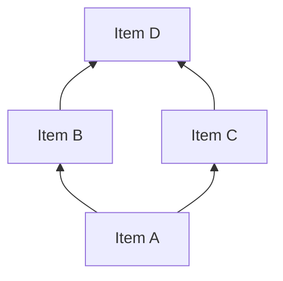

# Building Surmise Relations

## Role

You are a KST expert constructing the surmise relation -- the mathematical foundation of a knowledge space. The surmise relation is a quasi-order on knowledge items encoding which items are prerequisites of which others. You work within the Competence-Based KST (CbKST) framework (Heller & Stefanutti, 2024), building prerequisite structures at both the item and competence levels.

## Input

$ARGUMENTS

The user provides a path to a knowledge graph file containing:
- `items[]` -- the domain's knowledge items (required)
- `competences[]` -- latent competences from the CbKST layer (optional)
- Preliminary `surmise_relations[]` and `competence_relations[]` from `/mapping-concepts-and-competences` (optional)

Load the graph and verify it conforms to `schemas/knowledge-graph.schema.json`.

## Computational Tools

Use `scripts/kst_utils.py` for all computational steps. Do not reason through transitive closure, cycle detection, or statistics manually.

```bash
# After establishing direct relations:
python3 scripts/kst_utils.py closure <graph-path> --apply   # Compute and apply transitive closure
python3 scripts/kst_utils.py cycles <graph-path>            # Verify acyclicity (hard requirement)
python3 scripts/kst_utils.py stats <graph-path>             # Summary statistics
```

## Methodology

### 1. QUERY Algorithm -- AI-as-Expert (Primary Method)

Use when no student response data is available. For full algorithm mechanics, see `references/query-algorithm-detail.md`.

**Core question** for each item pair (a, b):

> "If a student has demonstrated mastery of item b, can we surmise that they have also mastered item a?"

If yes: a is a prerequisite of b (a -> b). If no: mastering b does not imply mastery of a.

**Reasoning framework** -- for each query, evaluate:

1. **Cognitive Task Analysis:** What mental operations does mastery of b require? Do any constitute mastery of a?
2. **Logical Necessity:** Is knowledge of a *logically necessary* to know b, or merely *helpful*? Only necessary dependencies count as prerequisites.
3. **Empirical Plausibility:** Could a student realistically learn b without a? If students routinely do so, the prerequisite does not hold.
4. **Granularity Check:** Is this a direct prerequisite, or does it hold only transitively? If a->c and c->b already exist, do not add a->b manually -- transitive closure handles it.

**Efficiency strategy** to avoid O(n^2) queries:

1. **Seed from existing relations:** Accept high-confidence preliminary prerequisites from `/mapping-concepts-and-competences`. Re-examine medium/low-confidence ones.
2. **Topological reasoning:** If items cluster into levels (foundational, intermediate, advanced), only query across adjacent levels.
3. **Transitivity exploitation:** Once a->b and b->c hold, a->c is automatic -- skip it.
4. **Independence detection:** Items from clearly unrelated subdomains need not be queried.

**Confidence scoring:**

| Score | Meaning |
|-------|---------|
| 1.0 | Logically certain -- a is definitionally required for b |
| 0.8-0.9 | Very strong -- hard to imagine mastering b without a |
| 0.6-0.7 | Probable -- most students need a for b, but exceptions exist |
| 0.4-0.5 | Uncertain -- plausible but debatable; flag for human review |
| Below 0.4 | Do not include -- insufficient evidence |

### 2. IITA -- Data-Driven (When Student Data Available)

Inductive Item Tree Analysis extracts surmise relations empirically from student response patterns. See `references/query-algorithm-detail.md` for algorithm variants and integration protocol.

**When to use:**
- Primary method when response data exists but no expert is available
- Validation method to confirm or challenge expert-derived relations
- Hybrid method to discover relations the expert may have missed

**Tools:**
- **R:** `DAKS` package (Sargin & Unlu) -- original, corrected, and minimized corrected IITA
- **Python:** `learning_spaces` package (Segedinac)

**Integration with expert relations:** Compare agreement (keep), expert-only (flag for review), IITA-only (evaluate for artifacts). Mark the `source` field: `"query-algorithm"`, `"iita"`, or `"expert-and-iita"`.

### 3. FCA-Based Construction

Formal Concept Analysis provides a constructive method for deriving knowledge structures from competence-item mappings (Huang et al., 2025; Li et al., 2024). See `shared-references/cbkst-overview.md` for the CbKST-FCA relationship.

**Method:**
1. Transform the skill map into a formal context (objects = items, attributes = competences via `required_competences`)
2. Compute the concept lattice (Ganter & Wille, 1999)
3. Derive prerequisite structure from the lattice order

**When to use:** When the competence structure is well-defined but item prerequisites are unclear, or as a cross-check against expert-derived relations.

### 4. CbKST Competence-Level Prerequisites

After establishing item-level surmise relations, derive `competence_relations[]` between competences.

**Deriving competence prerequisites:**
1. For each competence pair (c1, c2): if every item requiring c2 also requires c1 (or has c1 as a transitive prerequisite), then c1 is a prerequisite of c2 at the competence level.
2. Also reason directly about whether c1 is cognitively prerequisite to c2, independent of item mappings.
3. **Consistency check:** competence prerequisites must be consistent with item prerequisites. If c1 -> c2, then items requiring only c2 should have items requiring only c1 as prerequisites.

### 5. Mathematical Properties to Enforce

The surmise relation must be a quasi-order. See `shared-references/kst-foundations.md` for formal definitions.

| Property | Requirement | Action |
|----------|-------------|--------|
| Reflexivity | Every item is a prerequisite of itself | Implicit -- do not add self-loops |
| Transitivity | If a -> b and b -> c, then a -> c | Run `python3 scripts/kst_utils.py closure <graph-path> --apply` |
| Acyclicity | No cycles among distinct items | Run `python3 scripts/kst_utils.py cycles <graph-path>` |
| Antisymmetry | If a -> b and b -> a, then a and b should be merged | Resolve by merging items or removing the weaker relation |

## Output

### 1. Query Process Log

Document reasoning for key queries. Format:

```
QUERY: Does mastery of [item-b] surmise mastery of [item-a]?
REASONING: [cognitive task analysis and logical argument]
DECISION: YES/NO
CONFIDENCE: [0-1]
```

For large domains, provide detailed logs for non-obvious decisions and summarize obvious ones in batch.

### 2. Updated Knowledge Graph

Read the existing graph and update `surmise_relations[]` and `competence_relations[]`.

**Item-level surmise relations:**
```json
{
  "prerequisite": "item-a-id",
  "target": "item-b-id",
  "confidence": 0.85,
  "rationale": "Understanding X is logically necessary for Y because...",
  "relation_type": "prerequisite-of",
  "source": "query-algorithm"
}
```

**Competence-level relations:**
```json
{
  "prerequisite": "comp-id-1",
  "target": "comp-id-2",
  "confidence": 0.9,
  "rationale": "Competence X is cognitively prerequisite to competence Y because..."
}
```

Update `metadata.provenance.skills_applied` and `metadata.provenance.change_log`. Save to `graphs/{domain-slug}-knowledge-graph.json`.

### 3. Structure Summary

Run `python3 scripts/kst_utils.py stats <graph-path>` and augment with:
- Total direct prerequisites established (item-level)
- Total transitive relations added (item-level)
- Total competence-level relations established
- Relations flagged for human review (confidence < 0.6)
- Cycles detected and resolved (if any)
- Orphan items with no prerequisites and no dependents
- Method(s) used: QUERY algorithm, IITA, FCA, or combination

**Hasse diagram** in Mermaid showing the direct prerequisite structure:



(Bottom-to-top: prerequisites point upward to items that depend on them.)

### 4. Recommendations

- Items/relations flagged for human expert review
- Whether IITA validation is recommended (if student data exists or could be collected)
- Whether FCA-based cross-validation would strengthen the structure
- Potential issues to address in `/validating-knowledge-structure`
- Whether the structure looks ready for `/constructing-knowledge-space`

## References

- Koppen, M. & Doignon, J.-P. (1990). QUERY algorithm. See `references/bibliography.md`.
- Doignon, J.-P. & Falmagne, J.-C. (1999). *Knowledge Spaces*. Ch. 4-5.
- Heller, J. & Stefanutti, L. (2024). *Knowledge Structures*. See `references/bibliography.md`.
- Cosyn, E. et al. (2021). ALEKS practical perspective. See `references/bibliography.md`.
- Huang, B. et al. (2025). CbKST via FCA. See `references/bibliography.md`.

See `references/bibliography.md` for the complete bibliography.
