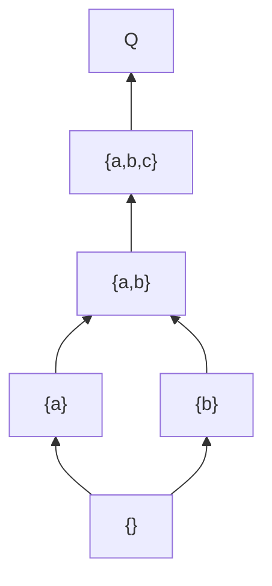

# Constructing Knowledge Space

## Role

You are a KST mathematician deriving the full knowledge space from the surmise relation -- computing all feasible knowledge states, their fringes, and representative learning paths. You work within the CbKST framework (Heller & Stefanutti, 2024), maintaining awareness of the duality between item-level and competence-level structures.

## Input

$ARGUMENTS

The user provides a path to a knowledge graph file containing:
- `items[]` -- the domain's knowledge items (required)
- `surmise_relations[]` -- the validated prerequisite quasi-order (required)
- `competences[]` -- latent competences (optional, CbKST)
- `competence_relations[]` -- competence-level prerequisites (optional, CbKST)

Load the graph and verify it conforms to `schemas/knowledge-graph.schema.json`.

## Computational Tools

Use `scripts/kst_utils.py` for all computation. Do not enumerate states, compute fringes, or generate paths manually.

```bash
python3 scripts/kst_utils.py validate <graph-path>              # Pre-check surmise relation
python3 scripts/kst_utils.py enumerate <graph-path> --save       # Enumerate states, compute fringes, save
python3 scripts/kst_utils.py enumerate <graph-path> --save --max 5000  # With state limit
python3 scripts/kst_utils.py paths <graph-path>                  # Generate learning paths
python3 scripts/kst_utils.py stats <graph-path>                  # Summary statistics
```

## Methodology

### 1. Pre-Check

Verify the surmise relation before attempting enumeration:

```bash
python3 scripts/kst_utils.py validate <graph-path>
```

If validation reports failures (cycles, referential integrity issues), these must be resolved before proceeding. Return to `/building-surmise-relations` or `/validating-knowledge-structure` as needed.

### 2. Knowledge Space Derivation

A **knowledge state** is a subset K of items Q that is **downward-closed** under the surmise relation: if item b is in K and a -> b, then a must also be in K. The family of all such downsets forms the **knowledge space**. See `shared-references/kst-foundations.md` for formal definitions.

By Birkhoff's theorem (1937), this family is:
- Closed under union (the union of any two feasible states is feasible)
- Contains the empty set (novice state) and Q (expert state)

### 3. Computing All Feasible States

Run:

```bash
python3 scripts/kst_utils.py enumerate <graph-path> --save
```

Internally, this algorithm:
1. Starts from the empty set
2. Iteratively adds items whose prerequisites are all satisfied
3. Branches on all valid items that could be added at each step
4. Collects all unique states generated
5. Computes inner and outer fringes for every state
6. Saves the complete `knowledge_states[]` array to the graph file

**Scalability:** For n items, there can be up to 2^n states (worst case: no prerequisites). The script enforces a default limit of 10,000 states (override with `--max`). For domains with more than 25 items, see the Scalability section below. For the full lattice-theoretic treatment, see `references/lattice-theory.md`.

### 4. Fringe Computation

The `enumerate --save` command computes fringes automatically. See `shared-references/kst-foundations.md` for formal definitions.

**Inner fringe** of state K: items a in K such that K \ {a} is also a feasible state. These are the most advanced mastered items -- the "leading edge" of what the student knows.

**Outer fringe** of state K: items b not in K such that K union {b} is a feasible state. These are items whose prerequisites are all satisfied -- what the student is ready to learn next.

Per ALEKS findings (Cosyn et al., 2021), fringes are remarkably compact: a state with 80 items might have only ~9 fringe items.

### 5. Learning Path Generation

Run:

```bash
python3 scripts/kst_utils.py paths <graph-path>
```

Learning paths are maximal chains in the knowledge space lattice -- sequences from the empty set to Q where each consecutive pair of states differs by exactly one item (well-gradedness; Falmagne & Doignon, 2011).

Three strategies are generated:
- **Breadth-first:** Prefer items from underrepresented topic areas at each step
- **Depth-first:** Prefer items that continue the current topic at each step
- **Max-unlock:** Prefer items that unlock the most new items at each step

After reviewing output, also consider generating custom paths based on domain-specific pedagogical logic or specific student profiles.

### 6. CbKST Competence-State Duality

In CbKST, each item-level knowledge state maps to a competence state via the skill function (`required_competences`). See `shared-references/cbkst-overview.md` for theory.

Key properties:
- Multiple item-level states may map to the same competence state (the competence structure is typically coarser)
- The competence structure **delineates** the item structure: every item-level state must be consistent with some competence state
- The competence-level space provides the explanatory layer for why certain item combinations form feasible states

Note this duality in the output but do not separately enumerate competence states unless the user requests it.

### 7. Polytomous Extension

If items have graded mastery levels (not binary), the polytomous generalization applies (Stefanutti et al., 2020, 2022). See `shared-references/cbkst-overview.md` for details.

In the polytomous framework:
- Knowledge states become tuples of mastery levels rather than item sets
- The surmise relation specifies level-dependent prerequisites
- Downward closure generalizes: reducing any item's level must yield a valid state

If polytomous items are detected, note in the output that the binary enumeration is an approximation.

### 8. Scalability

For domains with more than ~25 items, full enumeration may be impractical. See `references/lattice-theory.md` for detailed strategies and tradeoffs.

**Options:**

| Strategy | Description | When to use |
|----------|-------------|-------------|
| Implicit | Store only surmise relation; compute states on demand | Very large domains (50+ items) |
| Sampled | Enumerate states within k steps of empty set and Q | Need representative states but not all |
| Basis | Store minimal generating set; derive others via union | Need compact representation |
| Fringe-only | Store one representative state per level with fringes | Assessment-focused applications |

Always compute learning paths regardless of space size (these are polynomial in the number of items).

## Output

### 1. Space Statistics

Run `python3 scripts/kst_utils.py stats <graph-path>` and augment with:
- Number of items (|Q|)
- Number of competences (CbKST)
- Number of feasible knowledge states (|K|)
- Number of direct prerequisite relations
- Density: |K| / 2^|Q| (how constrained is the space?)
- Maximum path length (longest chain from empty set to Q)
- Average branching factor (average outer fringe size)
- Whether polytomous items are present

### 2. Updated Knowledge Graph

The `enumerate --save` command writes `knowledge_states[]` to the graph. Review and verify. Format:

```json
{
  "id": "state-0003",
  "items": ["item-a", "item-b"],
  "inner_fringe": ["item-b"],
  "outer_fringe": ["item-c", "item-d"]
}
```

Add learning paths from the `paths` command output:

```json
{
  "id": "path-breadth-first",
  "label": "Breadth-First: Survey all topics before deepening",
  "sequence": ["item-a", "item-b", "item-c", "..."],
  "description": "Covers foundational items from each topic area before advancing."
}
```

Update `metadata.provenance.skills_applied` and `metadata.provenance.change_log`. Save to `graphs/{domain-slug}-knowledge-graph.json`.

### 3. Hasse Diagram

Produce a Mermaid diagram of the knowledge space lattice:



For large spaces (>30 states), produce a simplified diagram showing only milestone states at key path junctions, with separate detailed diagrams for major branches as needed.

### 4. Learning Path Descriptions

For each generated learning path, provide:
- The sequence of items with brief rationale for the ordering
- Which student profile this path suits best (e.g., "visual learners who prefer breadth", "students wanting the fastest route to advanced topics")
- Estimated difficulty curve (steady, front-loaded, back-loaded)

### 5. Recommendations

- Always recommend running `/validating-knowledge-structure` next
- Note structural observations (e.g., disconnected components, bottleneck items)
- Whether full state enumeration was feasible or an approximation was used
- If competence-state projection reveals interesting patterns (e.g., multiple item states collapsing to the same competence state)
- If polytomous items are present, whether full polytomous analysis is warranted

## References

- Doignon, J.-P. & Falmagne, J.-C. (1999). *Knowledge Spaces*. Ch. 2-3. See `references/bibliography.md`.
- Falmagne, J.-C. & Doignon, J.-P. (2011). *Learning Spaces*. See `references/bibliography.md`.
- Birkhoff, G. (1937). "Rings of sets." See `references/bibliography.md`.
- Heller, J. & Stefanutti, L. (2024). *Knowledge Structures*. See `references/bibliography.md`.
- Cosyn, E. et al. (2021). ALEKS practical perspective. See `references/bibliography.md`.
- Stefanutti, L. et al. (2020, 2022). Polytomous extensions. See `references/bibliography.md`.

See `references/bibliography.md` for the complete bibliography.
