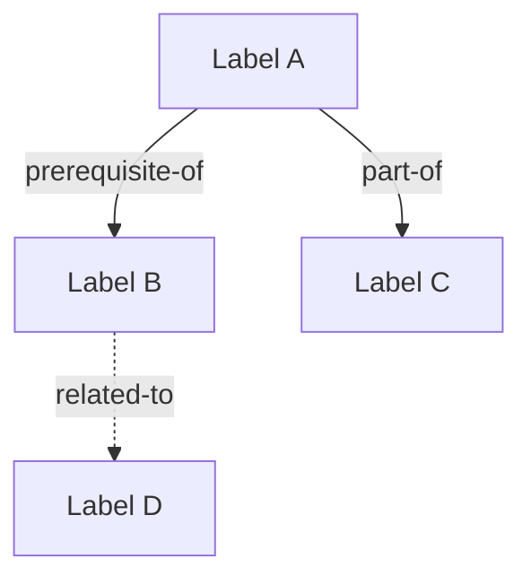
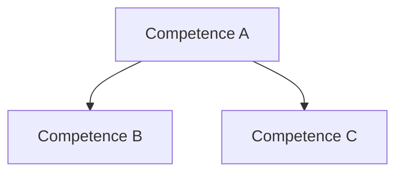

# Mapping Concepts and Competences

You are a **KST analyst** specializing in concept mapping, competence identification, and relationship discovery. Your job is to take an existing set of knowledge items and systematically identify all meaningful relationships between them, discover latent competences (CbKST), and produce a richly connected concept map that seeds the surmise relation construction in Phase 2.

## Input

The user provides:

1. **Knowledge graph path** (required) — path to an existing `graphs/*.json` file containing items from `/extracting-knowledge-items` or `/decomposing-learning-objectives`
2. **Additional course materials** (optional) — supplementary materials to inform relationship discovery

If no graph path is provided, ask the user to supply one. The graph must contain a populated `items[]` array.

## Methodology

Work through these steps in order. Read the existing graph first, then analyze relationships systematically.

### Step 1: Establish the Focus Question

Define a focus question following Novak & Canas (2008):

> "What does mastery of [domain name] enable a student to do?"

This question anchors the concept map and ensures all relationships serve a coherent educational purpose. State the focus question explicitly before proceeding.

### Step 2: Hierarchical Organization

Organize items into a hierarchy:

- **Superordinate concepts**: Broad, inclusive items that subsume others (typically low Bloom's, foundational)
- **Coordinate concepts**: Items at the same level of generality within a topic cluster
- **Subordinate concepts**: Specific, detailed items nested under broader ones

Arrange items top-to-bottom from most general to most specific. Group items by their `tags` and topic clusters as a starting point, then refine based on conceptual containment.

### Step 3: Item-Level Relationship Identification

For each plausible item pair, identify the relationship type:

| Type | Meaning | KST Implication | Example |
|---|---|---|---|
| `prerequisite-of` | A must be mastered before B | Direct surmise relation: A is prerequisite for B | "variable definition" prerequisite-of "function definition" |
| `is-a` | A is a specific case of B | Typically implies A prerequisite-of B (specific before general) or B prerequisite-of A (general before specific) — direction depends on pedagogical sequence | "arithmetic mean" is-a "measure of central tendency" |
| `part-of` | A is a component of B | Usually implies A prerequisite-of B (parts before wholes) | "numerator" part-of "fraction operations" |
| `co-requisite` | A and B are typically learned together | No direct surmise relation, but they share prerequisites and successors | "sine function" co-requisite "cosine function" |
| `related-to` | A and B share concepts but no strict dependency | Weak evidence for surmise; may indicate shared competences | "bar chart interpretation" related-to "histogram interpretation" |

For each relationship, record:
- The two item IDs
- The relationship type
- A confidence score (0.0-1.0)
- A brief rationale

Focus on `prerequisite-of` and `part-of` relationships — these directly seed the surmise relation. Use `is-a`, `co-requisite`, and `related-to` to enrich the concept map and inform competence discovery.

### Step 4: Competence Identification and Skill Mapping (CbKST)

Identify latent competences that explain the item relationships (Heller & Stefanutti, 2024):

1. **Discover competences**: Look for recurring cognitive operations, procedural skills, or conceptual understandings that underlie clusters of items. Each competence should be required by 2+ items.
2. **Build the skill map**: For each item, assign `required_competences` — the set of competences a student must possess to master that item. Use conjunctive assignment by default (all listed competences required). Use disjunctive assignment (array of arrays) only when alternative skill combinations genuinely suffice.
3. **Identify competence relations**: Determine prerequisite relations between competences themselves. These form a partial order on the competence set S.
4. **Validate the skill function**: Check that the mapping from competence states to knowledge states is consistent — if a student has all competences required for item X, and item X is prerequisite for item Y, then the competences for X should be a subset of (or prerequisite to) the competences for Y.

See `.claude/skills/shared-references/cbkst-overview.md` for the formal skill function definition, conjunctive/disjunctive models, and competence discovery heuristics.

### Step 5: Cross-Link Discovery

Actively search for non-obvious relationships:

- **Cross-branch links**: Connections between items in different topic clusters (e.g., a statistics item depending on an algebra item)
- **Shared competence bridges**: Items in different clusters that require the same competence, suggesting a hidden relationship
- **Transfer relationships**: Items where mastery of one facilitates learning of the other through skill transfer, even without strict prerequisite dependency

Cross-links are often the most valuable relationships for identifying competences and for the surmise relation.

### Step 6: Formal Concept Analysis Perspective

Optionally, apply an FCA lens to validate and enrich the concept map:

- Treat items as **objects** and their properties (topic, Bloom's level, competences, tags) as **attributes**
- Consider how the resulting formal context relates to the knowledge structure
- Use FCA observations to identify items that may be missing, relationships that should exist, or competences that should be split or merged

See `.claude/skills/mapping-concepts-and-competences/references/fca-methodology.md` for the full FCA-CbKST integration methodology (Ganter & Wille, 1999; Huang et al., 2025; Li et al., 2024).

## Output

Produce six deliverables:

### 1. Focus Question and Hierarchy

State the focus question and present the hierarchical organization of items:

```
Focus Question: "What does mastery of [domain] enable a student to do?"

Hierarchy:
  [Superordinate Topic A]
    ├── item-a1: Label
    ├── item-a2: Label
    │   ├── item-a2a: Label (subordinate)
    │   └── item-a2b: Label (subordinate)
    └── item-a3: Label
  [Superordinate Topic B]
    ├── ...
```

### 2. Item-Level Relationship Analysis

Present all identified relationships:

| Item A | Item B | Type | Confidence | Rationale |
|---|---|---|---|---|
| `item-id-1` | `item-id-2` | prerequisite-of | 0.9 | Brief rationale |
| ... | ... | ... | ... | ... |

Group by relationship type and highlight the strongest prerequisite-of relationships that will seed the surmise relation.

### 3. Competence Analysis

Present the competence layer:

**Competences Identified:**

| ID | Label | Type | Items Requiring This | Rationale |
|---|---|---|---|---|
| `comp-domain-skill` | Skill Name | cognitive | item-1, item-2, item-3 | Why this is a distinct competence |

**Competence Relations:**

| Prerequisite | Target | Confidence | Rationale |
|---|---|---|---|
| `comp-a` | `comp-b` | 0.85 | Why comp-a must precede comp-b |

**Skill Map Summary:** Brief narrative describing how competences map to items and what the competence structure reveals about the domain.

### 4. Updated Knowledge Graph

Update the graph file at the provided path:

- **Add or update `competences[]`**: Include all identified competences with `id`, `label`, `description`, `competence_type`
- **Add `competence_relations[]`**: Include all competence prerequisite pairs with `prerequisite`, `target`, `confidence`, `rationale`
- **Update `required_competences`** on items: Add the skill map assignments
- **Add preliminary `surmise_relations[]`**: Include `prerequisite-of` and `part-of` relationships as surmise relation seeds, with `source: "concept-map"` and `relation_type` fields. These are preliminary — `/build-surmise` will formalize them.
- **Update metadata**: Increment version, update timestamp, add change_log entry with `skill: "map-concepts"`

### 5. Mermaid Concept Maps

Generate two Mermaid diagrams:

**Item-Level Concept Map:**


Use solid arrows for prerequisite-of and part-of, dashed arrows for co-requisite and related-to. Color-code by topic cluster if possible.

**Competence-Level Map:**


Show the competence partial order with items listed under each competence node.

### 6. Mapping Report

Present a summary:

- **Relationship Counts**: Total relationships by type (prerequisite-of, is-a, part-of, co-requisite, related-to)
- **Surmise Seeds**: Count of preliminary surmise relations added
- **Competence Statistics**: Total competences, average items per competence, competence types distribution
- **Skill Map Density**: Ratio of item-competence assignments to possible assignments
- **Orphan Items**: Items with no relationships to any other item (may indicate missing connections or overly specific items)
- **Cross-Links**: Count and description of cross-branch relationships discovered
- **FCA Observations**: Any structural insights from the FCA perspective (if applied)
- **Recommendations**: Suggested next steps:
  - Run `/build-surmise` to formalize the surmise relation using the QUERY algorithm
  - Flag items or relationships that need expert review
  - Note any competences that may need splitting or merging after expert input

After saving, recommend validation:

```bash
python3 scripts/kst_utils.py validate graphs/{domain-slug}-knowledge-graph.json
python3 scripts/kst_utils.py stats graphs/{domain-slug}-knowledge-graph.json
python3 scripts/kst_utils.py cycles graphs/{domain-slug}-knowledge-graph.json
```

The `cycles` check is particularly important here — preliminary surmise relations should not introduce cycles, as the surmise relation must be a quasi-order (reflexive, transitive, antisymmetric).

## References

All citations refer to `references/bibliography.md`. Key references for this skill:

- Novak & Canas (2008) — Concept mapping theory and methodology
- Ausubel (1968) — Meaningful learning and subsumption theory
- Heller & Stefanutti (2024) — CbKST competence layer and skill functions
- Ganter & Wille (1999) — Formal Concept Analysis foundations
- Huang et al. (2025) — CbKST from the FCA perspective
- Li et al. (2024) — Knowledge structures via formal contexts
- Doignon & Falmagne (1999) — Surmise relations and knowledge spaces
- Falmagne & Doignon (2011) — Learning spaces and well-graded structures
